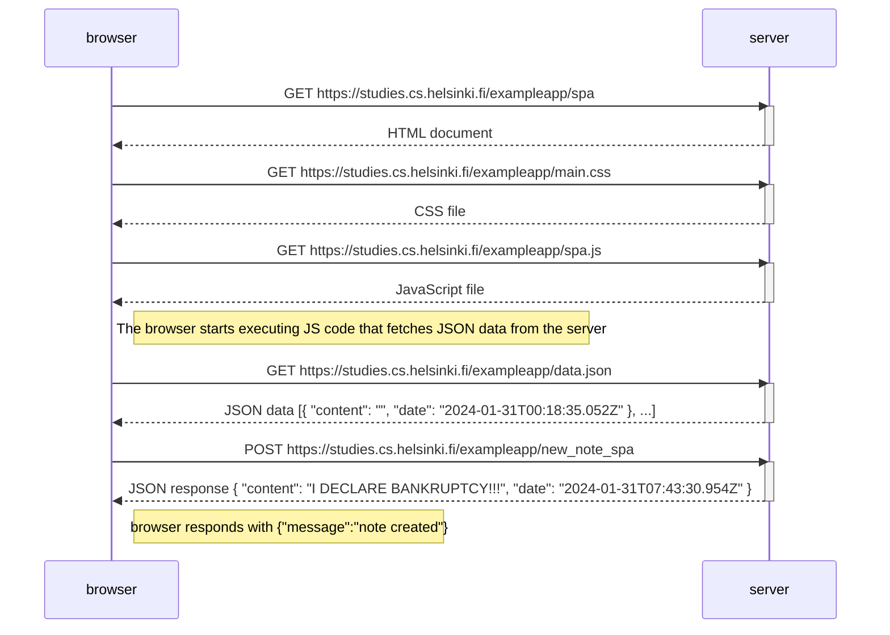

# Exercise 0.6
## Sequence diagram for posing a new note to the Single Page Application (SPA) version of the app

```mermaid
sequenceDiagram
    participant browser
    participant server

    browser->>server: GET https://studies.cs.helsinki.fi/exampleapp/spa
    activate server
    server-->>browser: HTML document
    deactivate server

    browser->>server: GET https://studies.cs.helsinki.fi/exampleapp/main.css
    activate server
    server-->>browser: CSS file
    deactivate server

    browser->>server: GET https://studies.cs.helsinki.fi/exampleapp/spa.js
    activate server
    server-->>browser: JavaScript file
    deactivate server

    Note right of browser: The browser starts executing JS code that fetches JSON data from the server

    browser->>server: GET https://studies.cs.helsinki.fi/exampleapp/data.json
    activate server
    server-->>browser: JSON data [{ "content": "", "date": "2024-01-31T00:18:35.052Z" }, ...]
    deactivate server

    browser->>server: POST https://studies.cs.helsinki.fi/exampleapp/new_note_spa
    activate server
    server-->>browser: JSON response { "content": "I DECLARE BANKRUPTCY!!!", "date": "2024-01-31T07:43:30.954Z" }
    deactivate server

    Note right of browser: browser responds with {"message":"note created"}
```
